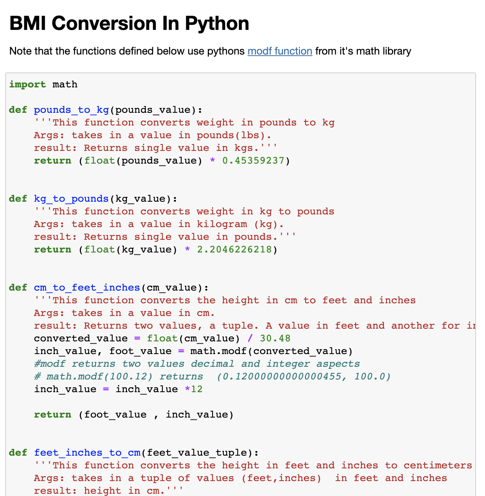
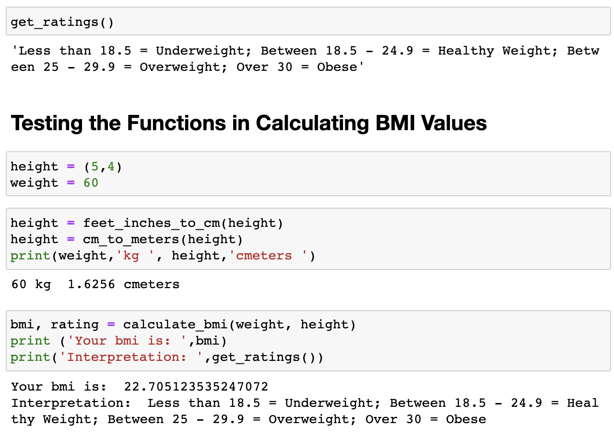

# BMI-conversion
Quck BMI conversion functions in python for a work/health project. Calculate BMI from the terminal along with a notebook explaining how the functions work.

---

## Folder Structure
This repository contains only the notebooks for file exploration
Main Folder
   |--BMI Notebook.ipynb  
   |  
   |--bmifunctions.py 
   |  
   |--README.md  

## Descriptions
1. BMI Notebook File
    A notebook file explaining each convertion function and how they can be used to convert input data. 
    
2.  
A bmifunction.py file with a breakdown of functions in the project.

## Images

